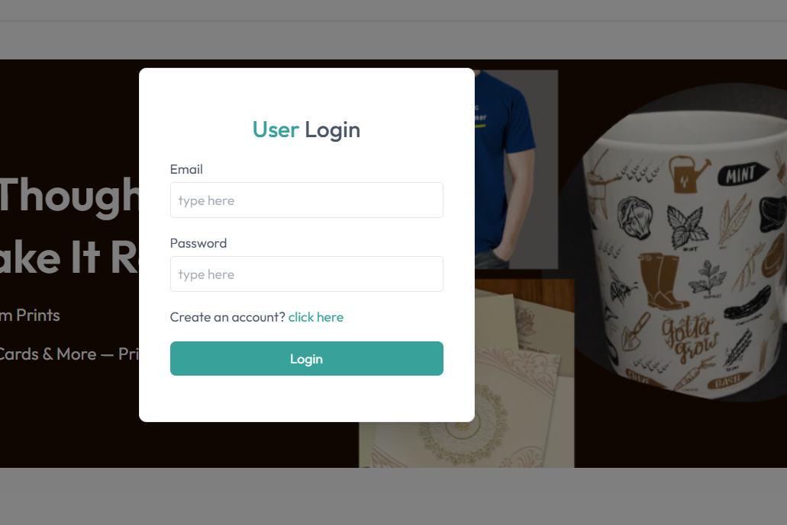
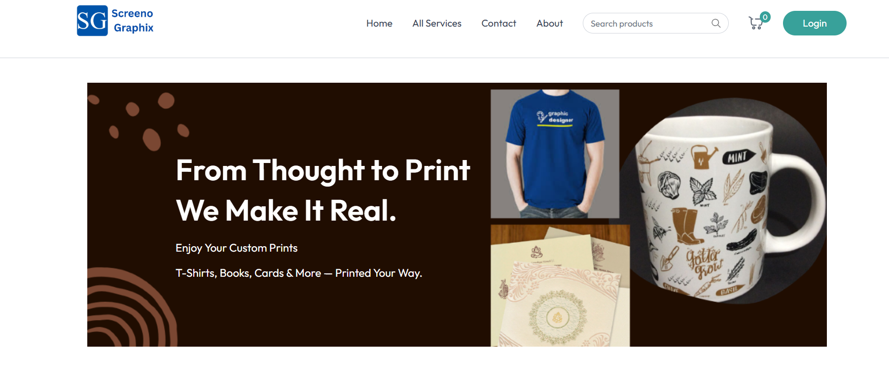
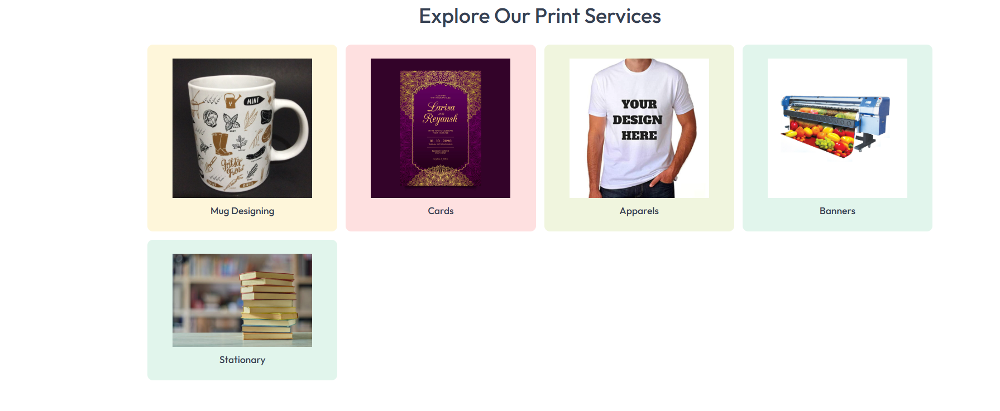
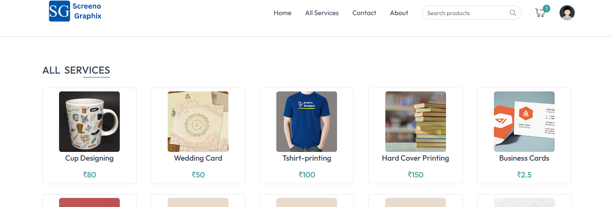
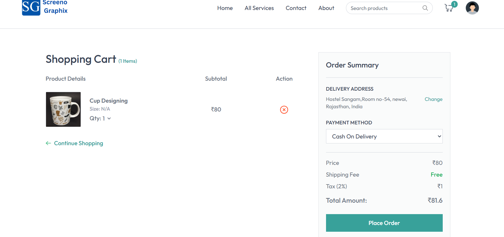
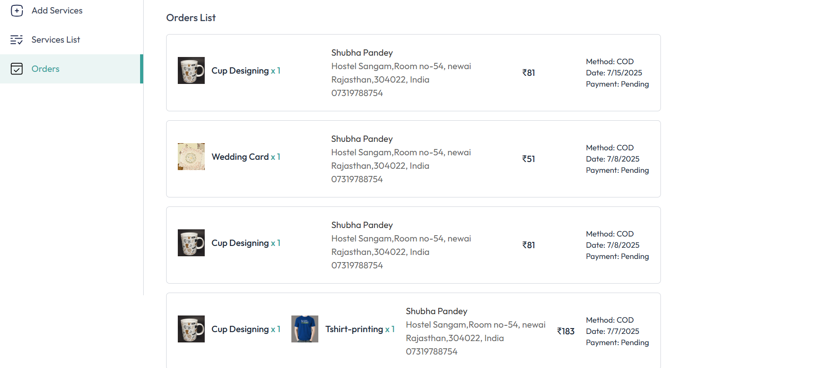
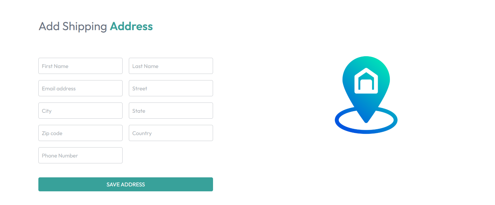
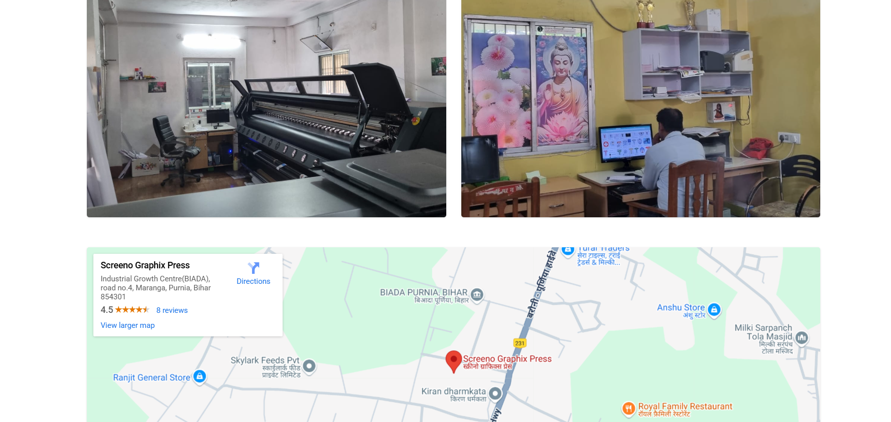
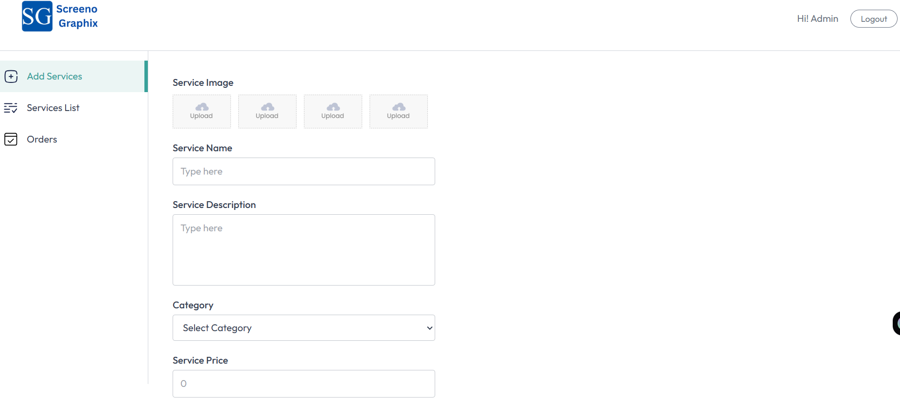
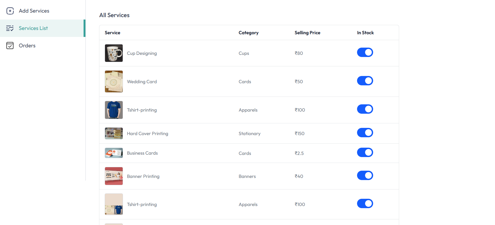

# 🎨 Screeno Graphix

**Screeno Graphix** is a modern **printing service platform** where customers can personalize and order custom print products like **cup designs**, **t-shirts**, and **posters**, delivered right to their **doorstep**.  
Admins can manage available services, review customer orders, and monitor secure online payments via **Stripe**.

---

## 🌟 Features

### 👤 Customers Can:
- 🛒 Browse and choose from multiple print services
- ✏️ Upload custom designs or text
- 💳 Pay securely online using **Stripe**
- 📬 View order history and live status
- 🚚 Get orders delivered to their doorstep

### 🛠️ Admins Can:
- ➕ Add, update, or delete print services
- 📦 Review and manage customer orders
- 🔁 Change order statuses (Pending → In Progress → Shipped → Delivered)
- 💵 View Stripe-based transactions and status

---

## 💻 Technologies Used

<p>
  
  
  
  
  
  
</p>

---

## 🔐 Authentication & Payments

- Role-based authentication for **Customer** and **Admin**
- Protected routes and user sessions
- Stripe integration for secure and fast online transactions

---

## 📸 Screenshots
### 🏠 Login Page  

### 🏠 Home Page  



### 🛍️ Service Selection  


### 🛍️ Cart 



### 📋 Customer Order History  


### 📋 Add Adresses


### 📋 About Us




### 🛠️ Admin Dashboard  


### 🛠️ Service List



### 🛠️ Service List


---

## 📁 Folder Structure

screeno-graphix/
│
├── backend/
│ ├── controllers/
│ ├── models/
│ ├── routes/
│ ├── middleware/
│ └── server.js
│
├── frontend/
│ ├── src/
│ ├── components/
│ ├── pages/
│ ├── context/
│ └── App.js
│
├── screenshots/ # <- Add your images here
└── README.md

bash
Copy
Edit

---

## ⚙️ Getting Started

### Prerequisites

- Node.js & npm
- MongoDB (local or MongoDB Atlas)
- Stripe account with test keys
- Git

### Installation

```bash
# Clone the repository
git clone https://github.com/Shubha274/ScreenoPress.git


# Setup backend
cd backend
npm install
cp .env.example .env
# Add environment variables (MONGO_URI, STRIPE_SECRET_KEY, etc.)
npm run start

# Setup frontend
cd ../frontend
npm install
npm run dev


📦 Upcoming Features
 Customer email notifications on order status

 Admin analytics dashboard

 Review & rating system

 Coupon and discount support

📊 GitHub Stats
<p align="center">   </p>


🤝 Contributing
We welcome contributions!

Fork this repository

Create your branch: git checkout -b feature-name

Commit your changes: git commit -m "Add feature"

Push to the branch: git push origin feature-name

Open a Pull Request


📄 License
This project is licensed under the MIT License.

👩‍💻 Developed By
Shubha
